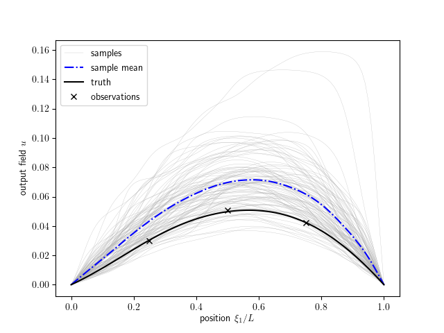
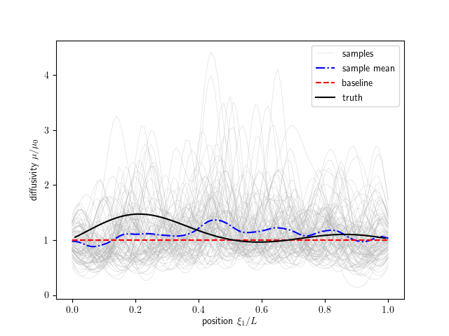
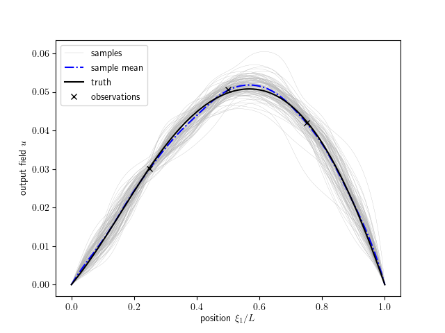
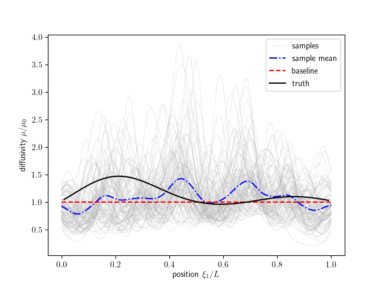

Tutorial: Diffusion
===================

Problem Description
-------------------
In this tutorial, we will focus on one dimension steady-state field inversion problem based on the heat diffusion equation. The equation for a rod can be expressed as following:

.. math::

   - \frac{d}{dx}(\mu \frac{du}{dx}) = f(x) \qquad x \in [0, 1]

where :math:`\mu` are unknown thermal diffusivity to be infered varying with the location in the rod, :math:`u` is the temperature and :math:`f(x)` is external heat source term which in this case is simplfied as :math:`f(x) = sin( 0.2 \pi x)`.

To solve the diffusion equation, the central difference scheme is used. The finite difference method is applied to replace the partial derivation of diffusivity in equation.

.. math::

   - \frac{d}{dx}(\mu \frac{du}{dx}) = -\frac{d\mu}{dx} \frac{du}{dx}+\mu\frac{du^2}{d^2x}=f(x)

with

.. math::

   \frac{du_i}{dx} = \frac{u_{i+1}-u_{i-1}}{2\Delta x}

.. math::

   \frac{du^2}{d^2x} = \frac{u_{i+1}-2u_i+u_{i-1}}{\Delta x^2}

The difference scheme can be expressed as below:

.. math::

   (\frac{1}{2\Delta x}\frac{\mu_{i+1}-\mu_{i}}{\Delta x} + \frac{\mu_i}{\Delta x^2})u_{i+1} + (-\frac{2\mu_i}{\Delta x^2})\mu_i+(-\frac{1}{2\Delta x}\frac{\mu_{i+1}-\mu_{i}}{\Delta x} + \frac{\mu_i}{\Delta x^2}) u_{i-1} = f(x_i)

Further this can be simplified to be written as

.. math::

  A_i u_{i+1} + B_i u_i + C_i u_{i-1} = f(x_i)

where

.. math::

  A_i = \frac{1}{2 \Delta x} \frac{d \mu_i}{d x} + \frac{\mu_i}{\Delta x^2};

  B_i = -\frac{2\mu_i}{\Delta x^2};

  C_i = -\frac{1}{2\Delta x} \frac{d \mu_i}{d x} + \frac{\mu_i}{\Delta x^2}

The first derivative of the diffusivity :math:`\frac{d \mu}{dx}` is calculated using central difference.
Finally, the scheme can be formulated in the matrix form as

.. math::

  Du = E, \text{and further}

  u = D^{-1} E

where :math:`D` is a tridiagonal matrix and E is a vector.
The space in this case is evenly devided into 100 mesh cells, and accordingly, the spatial interval is 0.01.

Field Representation
--------------------

Field inversion problem is of great interest in reality, however to infer a field based on sparse observation also increases the ill-posedness of the problem. The high dimensionalty comparing to the limited number of samples will lead to the ununiqueness of the solution.

Therefore it is necessary to reduce the dimensionality to indirectly characterize the field. To represent the field, the most widely used method is Karhunen-Loeve expansion which is commonly used to represent the stochatic process through a combination of a set of orthogonal functions. In this case, the method is leveraged to reduce the dimension of state varibles.

The field of diffusivity is reconstructed by a set of deterministic functions with corresponding random variables:

.. math::

   log(\hat{\mu}(x)) = \sum_{i=1}^m \omega_i \phi_i(x)

where the subscript indicates the :math:`i` th mode :math:`\omega_i`, is a random variable, :math:`\phi_i(x)` is the deterministic basis set, the :math:`\hat{\mu}` is the diffusivity normed by the prior, and the logarithm is to ensure the non-negativity of diffusivity.
Accordingly, the first derivative of the :math:`\hat{\mu}` can be written as

.. math::

    \frac{d \hat{\mu}}{d x} = \hat{\mu}(x) * \sum_{i=1}^m \omega_i \frac{d \phi_i(x)}{dx}

The prior of :math:`\mu(x)` is regarded as Gaussian random fields, where the covariance of two different location (kernel function) is described as:

.. math::

   K(x,x')=\sigma(x)\sigma(x')\text{exp}\left(-\frac{|x-x'|^2}{l^2}\right)

The prior variance :math:`\sigma(x)` is a constant or a spatially varying field. In this tutorial, it is chosen as 0.5.

The correction length scale :math:`l` is simplified as 0.02 in this tutorial.

The orthogonal basis function :math:`\phi_i(x)` take the form :math:`\phi_i(x)=\sqrt{\hat{\lambda}_i}\hat{\phi_i}(x)`, where :math:`\hat{\lambda}_i` and :math:`\hat{\phi}_i(x)` are the eigenvalues and eigenvectors, respectively, of the kernel :math:`K` computed from the Fredholm integral equation:

.. math::

   \int K(x,x')\hat{\phi}(x')dx' = \hat{\lambda}\hat{\phi}(x)

Thus we can obtain the diffusivity field through infering the randomized value :math:`\omega_i` based on the observation on temperature.

Building the Dynamic Model
--------------------------
To create a new dynamic model you need to create a python file in the folder "tutorials/diffusion/". The python script for diffusion model has been created in the "tutorials/diffusion/diffusion.py"

Diffusion Model Files
^^^^^^^^^^^^^^^^^^^^^

Below is an overview of the files required to run the data assimilation for diffusion model in DAFI. The required files are listed below.

==================   =============================  =============================
**File Type**        **File Name**                  **Directory**
Input File           ``dafi.in``                    ``/tutorials/diffusion``
Input File           ``diffusion.in``               ``/tutorials/diffusion``
Forward Model        ``diffusion.py``               ``/tutorials/diffusion``
==================   =============================  =============================

We start by importing all necessary packages. Note that we are importing some things from dafi:

* *PhysicsModel* class
* *random field* class

.. code-block:: python

      # standard library imports
      import ast
      import sys
      import math
      import os

      # third party imports
      import numpy as np
      import scipy.sparse as sp
      import yaml

      # local imports
      from dafi import PhysicsModel
      from dafi import random_field as rf

__init__ and input file
^^^^^^^^^^^^^^^^^^^^^^^

The ``init`` function is\:

.. code-block:: python

        # save the main input
        self.nsamples = inputs_dafi['nsamples']
        self.max_iteration = inputs_dafi['max_iterations']

        # required attributes
        self.name = '1D diffusion Equation'

        # case properties
        self.space_interval = 0.01
        self.max_length = 1

        # counter for number of state_to_observation calls
        self.counter = 0

        # read input file
        input_file = inputs_model['input_file']
        with open(input_file, 'r') as f:
            inputs_model = yaml.load(f, yaml.SafeLoader)
        self.mu_init = inputs_model['prior_mean']
        self.stddev = inputs_model['stddev']
        self.length_scale = inputs_model['length_scale']
        self.obs_loc = inputs_model['obs_locations']
        obs_rel_std = inputs_model['obs_rel_stddev']
        obs_abs_std = inputs_model['obs_abs_stddev']
        self.nmodes = inputs_model['nmodes']
        self.calculate_kl_flag = inputs_model['calculate_kl_flag']

        # create save directory
        self.savedir = './results_diffusion'
        if not os.path.exists(self.savedir):
            os.makedirs(self.savedir)

        # create spatial coordinate and save
        self.x_coor = np.arange(
            0, self.max_length+self.space_interval, self.space_interval)
        np.savetxt(os.path.join(self.savedir, 'x_coor.dat'), self.x_coor)

        # dimension of state space
        self.ncells = self.x_coor.shape[0]

        # create source term fx
        source = np.zeros(self.ncells)
        for i in range(self.ncells - 1):
            source[i] = math.sin(0.2*np.pi*self.x_coor[i])
        source = np.mat(source).T
        self.fx = source.A

        # create or read modes for K-L expansion
        if self.calculate_kl_flag:
            # covariance
            cov = rf.covariance.generate_cov(
                'sqrexp', self.stddev, coords=self.x_coor,
                length_scales=[self.length_scale])
            # KL decomposition
            eig_vals, kl_modes = rf.calc_kl_modes(
                cov, self.nmodes, self.space_interval, normalize=False)
            # save
            np.savetxt(os.path.join(self.savedir, 'KLmodes.dat'), kl_modes)
            np.savetxt(os.path.join(self.savedir, 'eigVals.dat'), eig_vals)
            np.savetxt(os.path.join(self.savedir, 'eigValsNorm.dat'),
                       eig_vals/eig_vals[0])
            self.kl_modes = kl_modes
        else:
            self.kl_modes = np.loadtxt('KLmodes.dat')

        # create observations
        true_obs = self._truth()
        std_obs = obs_rel_std * true_obs + obs_abs_std
        self.obs_error = np.diag(std_obs**2)
        self.obs = np.random.multivariate_normal(true_obs, self.obs_error)
        self.nobs = len(self.obs)

These inputs to the ``__init__ method`` are the list in the dafi input file (*inputs_dafi*) and the name for the dynamic model input file (*inputs_model*).

The model input file is created as ``diffusion.in``. In the input file, we define the required parameters\:

.. literalinclude:: ../../tutorials/diffusion/diffusion.in

In the input file, we specify the first guessed constant diffusivity, the field variance and the characteristic length scale to construct a random field.
Then we define the observation locations and the relative and absolute standard deviation for the observation.
Also, we specify the number of modes to represent the field. 

.. note::
    With more modes, we can represent the field more flexiblely. However if the field is a low order curve, the results will lead to worse when introducing too many modes.

synthetic observations
^^^^^^^^^^^^^^^^^^^^^^
We give a synthetic truth on the KL coefficient as:

.. math::
    \hat{\mu} = \sum_{i=1}^3 \omega_i \phi_i(x)

where :math:`\mathbf{\omega}=[1,1,1]`
The synthetic observation on the temperature is obtained by soliving the diffusion equation with the synthectic :math:`\mu`.

generate_ensemble
^^^^^^^^^^^^^^^^^

Now we start coding the required methods, starting with generate_ensemble.
This method is responsible for creating the initial distribution of states.
In this case, the state is the KL coefficient.
We are going to do this by assuming independent zero-mean uni-variance Gaussian distributions.
We generate the specified number of samples. The generated prior samples are shown in figures below.

.. code-block:: python

        return np.random.normal(0, 1, [self.nmodes, self.nsamples])

state_to_observation
^^^^^^^^^^^^^^^^^^^^

This method is to map the state to observation (i.e., temperature). The temperature is obtained by calling a private function ``_solve_diffusion_equation`` to solve the diffusion problem with given diffusivity. Further, The temperature value at the observation locations specified in the input file can be interpolated and taken as the model output to be analyzed with observations.

.. code-block:: python

        self.counter += 1
        u_mat = np.zeros([self.ncells, self.nsamples])
        model_obs = np.zeros([self.nobs, self.nsamples])
        # solve model in observation space for each sample
        for isample in range(self.nsamples):
            mu, mu_dot = self._get_mu_mudot(state_vec[:, isample])
            u_vec = self._solve_diffusion_equation(mu, mu_dot)
            model_obs[:, isample] = np.interp(self.obs_loc, self.x_coor, u_vec)
            u_mat[:, isample] = u_vec
        np.savetxt(os.path.join(self.savedir, f'U.{self.counter}'), u_mat)
        return model_obs

get_obs
^^^^^^^

This method is to return the observation and the observation error matrix. In the ``init`` method, the synthetic truth
in the termperature is obtained by calling a private function "_truth()". Further, the value at the specified obervation position is obtained and taken as the observation. The observation error covariance is generated based on the specified standard deviation of the observation in the input file.

.. code-block:: python

        return np.random.normal(0, 1, [self.nmodes, self.nsamples])

Running the code
----------------

Now that we have created our own dynamic model, and an input file for our specific case, we can run the ``/bin/dafi`` data assimilation code.
In order to run the code you will need to export the path of dafi files if you haven't already.
This is done as follows::

    export PYTHONPATH="<DAFI_DIR>:$PYTHONPATH"
    export PATH="<DAFI_DIR>/bin:$PATH"

where ``<DAFI_DIR>`` is replaced with the correct path to the DAFI directory.

Then we can create the dafi input file 'dafi.in' to specify self-defined parameters. The 'dafi.in' file is provided in the diffusion tutorial directory and shown below.

.. literalinclude:: ../../tutorials/diffusion/dafi.in

In this file, we need to specify the number of samples (nsamples), the maximum data assimilation iteration(max_iteration) and so on.

Finally, we can execute the data assimilation for diffusion system by typing code::

   dafi.py dafi.in

Information on the progress will be printed to the screen. The results are saved to the results_dafi directory, and we had our dynamic model save some results to results_diffusion as well.

'diffusion_plot.py' (located in '$tutorials/diffusion') is the postprocessing file to plot the inferred and observed field.

The data assimilation is complete! We have provided a post-processing script to visualize these results.
To execute the postprocessing, type code::

   ./plot_results.py

The plotted results are shown as below. Users can modify the 'diffusion_plot.py' for their own post-processing.

