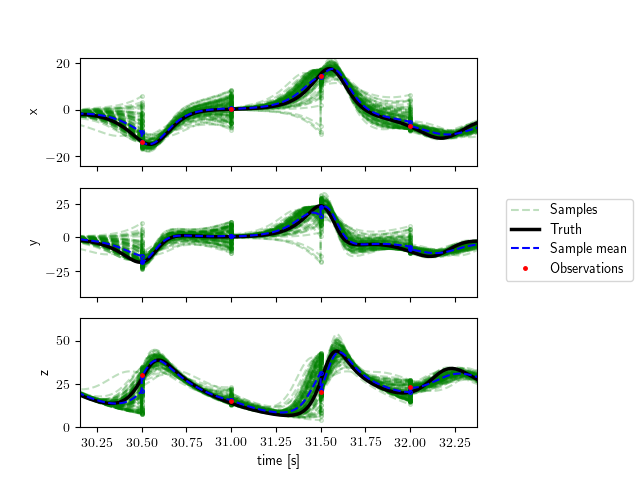

Tutorial: Lorenz63
==================

Problem Description
-------------------
As a first tutorial we will use the Lorenz (1963) model for atmospheric convection.
The model contains three states governed by a set of three coupled differential equations.
The governing ODEs are\:

.. math::

   \frac{dx}{dt} = \sigma (y - x)

   \frac{dy}{dt} = \rho x - y -xz

   \frac{dz}{dt} = xy - \beta z

where :math:`\sigma, \rho, \beta` are parameters.
These are three coupled ordinary differential equations.

The three states are\:

* **x** - proportional to convection.
* **y** - proportional to temperature differences.
* **z** - proportional to the vertical temperature variation from linearity.

The exact formulation is not important in this tutorial, but we will assume we can measure some of these states experimentally.
An example trajectory for a Lorenz system in state-space is shown below.

.. figure:: _static/Lorenz63.png
   :width: 400pt

We will assume that the Lorenz equations are the true governing equations for the system (i.e. there are no model-form uncertainty or simplifying assumptions).
We could then easily create a computational model, specify initial conditions and parameter values, and integrate forward in time.
However the Lorenz system is chaotic, and even small discrepancies in these values will eventually lead to completely diverged solutions.
The figure below is an example where the black line has initial conditions (:math:`x_0=-8.0`, :math:`y_0=-9.0`, :math:`z_0=28.0`) and the cyan line has (:math:`x_0=-8.1`, :math:`y_0=-9.0`, :math:`z_0=28.0`).
After less than a minute these two particles are in completely different locations in the state-space.

.. figure:: _static/lorenz_compare_initial_conditions.png
   :width: 400pt

.. note::
   In real applications you will probably not have the exact model (nor a chaotic one).
   Rather, the discrepancy between the truth and the model will be due in large part to the inadequacy of the model.
   The uncertainties in the initial conditions and parameters still have an effect, but are not the sole reason as it is in this tutorial.

On the other hand we could do experimental measurements.
However there are several potential downfalls.
The measurements could be far between (low sampling frequency), have large uncertainty, or be incomplete (measure only a few states).
Lets assume we do setup an experiment and we are able to measure the :math:`x` and :math:`z` states but not the :math:`y` state.
These measurements are taken at some specific sampling frequency and have a known level of inaccuracy.
Additionally we have some estimate for the initial conditions and parameters.

.. note::
   In this case the system has only 3 physical states.
   However, many realistic systems have much more states.
   For instance problems in continuous solid or fluid mechanics have infinite states (e.g. stress and strain at every point in a finite but continuous domain).
   In such cases measurements usually give you only a handful of states.

The computational model resolves all states at all times but is inaccurate (in this case due to its chaotic nature and input uncertainty).
The experiment has a known uncertainty but we cannot measure all three states, and can only obtain measurements at low sampling frequency.
Rather than relying solely on one or the other, we will use both the model and the experimental results in a data assimilation framework.
By assimilating the data into the model we should get more meaningful results than we could from either approach alone.
For the data assimilation we will use the Ensemble Kalman filter (EnKF), a Bayesian approach which takes into account how much we trust both the model (covariance between many instances/samples of the model) and the data (measurement uncertainty) to come up with a better prediction.
For more on the EnKF see the *Theory* section.

Additionally, a data-assimilation method allows us to infer any model parameter that is uncertain.
For this tutorial we will assume that we are very confident about the values of beta and sigma, but will let the algorithm infer the value of rho.

In this tutorial we will go step-by-step on how to build a model for our problem that we can couple with *dafi* to run the data assimilation.

Overview of dafi
--------------------
At its basic the code consists of 3 components\:

* the main executable
* a library of different data-assimilation methods
* a dynamic model (problem-specific and provided by you).

The main requirements of the dynamic model are to\:

* forecast a given initial condition through time
* forward a state vector to observation space
* provide the experimental measurements and errors.

The dynamic model needs to do the first two tasks for a given ensemble of state vectors (rather than a single state vector).
See the *Theory* section for more detail on ensemble methods.
In this tutorial we will go through how to build a dynamic model for our case, and how to run the code once the dynamic model is built.

These functionalities need to be implemented in a python file containing a class named *Solver* which contains the following attributes and methods.
The file needs to be saved in the ``source/dyn_models/`` directory.

Attributes\:

* **name**: Name of your choice for the model. ``str``
* **nstate**: Number of states in the state vector. ``int``
* **nstate_obs**: Number of states in the observation vector. ``int``
* **init_state**: Initial mean value of the state vector. ``ndarray``

Methods\:

* **__init__**
* **generate_ensemble**
* **forecast_to_time**
* **forward**
* **get_obs**
* **clean**

For all methods, look at the parent class (under ``source/da_inv/dyn_model.py``) for the appropriate inputs and outputs.

Building the Dynamic Model
--------------------------
To create a new dynamic model you need to create a python file in the folder ``source/dyn_models/``.
This file must contain a class called *Solver* which has *DynModel* as its parent class.
The class *DynModel* can be imported from ``data_assimilation.dyn_model``.
The *Solver* class then needs to have some required attributes and methods which will be discussed later.

For this case the file is already created and is named ``lorenz.py``.
It is recommended you open this file and follow along.
The code snippets in this tutorial do not include the docstrings.

We start by importing all necessary packages.
Note that we are importing some things from dafi:

* *DynModel* class
* the ``utilities`` package, which will help us read input files.

.. code-block:: python

    # standard library imports
    import os

    # third party imports
    import numpy as np
    from scipy.integrate import ode

    # local import
    from data_assimilation.dyn_model import DynModel
    import data_assimilation.utilities as utils

Before creating the *Solver* class, we will create a function for solving the Lorenz equations.
It will be helpful to have this as a separate function since we will call it several times.
The function takes in the initial states :math:`(x_0, y_0, z_0)`, the parameters :math:`(\rho, \beta, \sigma)`, and the time_series for integration.
The first entry of the time series is the initial time and is used to set the initial conditions.
All other entries are used in the integration.

The function lorenz63, takes states and parameter values and returns the time-rate-of-change of the states.
Time is included as in input even though it is not used because it is required by the ODE integrator.
This method is a straight-forward implementation of the Lorenz equations given earlier.
See documentation for scipy.integrate.ode for details on the integrator.

.. code-block:: python

    def solve_lorenz(time_series, init_state, parameters):
        # define Lorenz system
        def lorenz63(time, state, parameters):
            xstate, ystate, zstate = state
            rho, beta, sigma = parameters
            ddt_x = sigma * (ystate - xstate)
            ddt_y = rho*xstate - ystate - xstate*zstate
            ddt_z = xstate*ystate - beta*zstate
            return [ddt_x, ddt_y, ddt_z]

        # solve lorenz system
        solver = ode(lorenz63)
        solver.set_integrator('dopri5')
        solver.set_initial_value(init_state, time_series[0])
        solver.set_f_params(parameters)
        state = np.expand_dims(np.array(init_state), axis=0)
        for time in time_series[1:]:
            if not solver.successful():
                raise RuntimeError('Solver failed at time: {} s'.format(time))
            else:
                solver.integrate(time)
            state = np.vstack((state, solver.y))
        return state

__init__ and input file
^^^^^^^^^^^^^^^^^^^^^^^
The ``init`` function is\:

.. code-block:: python

    def __init__(self, nsamples, da_interval, t_end, max_da_iteration,
                 model_input):
        # save the main inputs
        self.nsamples = nsamples
        self.da_interval = da_interval
        self.t_end = t_end
        self.max_da_iteration = max_da_iteration

        # read input file
        param_dict = utils.read_input_data(model_input)
        dt_interval = float(param_dict['dt_interval'])
        x_init_mean = float(param_dict['x_init_mean'])
        y_init_mean = float(param_dict['y_init_mean'])
        z_init_mean = float(param_dict['z_init_mean'])
        rho_init_mean = float(param_dict['rho_init_mean'])
        x_init_std = float(param_dict['x_init_std'])
        y_init_std = float(param_dict['y_init_std'])
        z_init_std = float(param_dict['z_init_std'])
        rho_init_std = float(param_dict['rho_init_std'])
        beta = float(param_dict['beta'])
        sigma = float(param_dict['sigma'])
        x_obs_rel_std = float(param_dict['x_obs_rel_std'])
        z_obs_rel_std = float(param_dict['z_obs_rel_std'])
        x_obs_abs_std = float(param_dict['x_obs_abs_std'])
        z_obs_abs_std = float(param_dict['z_obs_abs_std'])
        x_true = float(param_dict['x_true'])
        y_true = float(param_dict['y_true'])
        z_true = float(param_dict['z_true'])
        rho_true = float(param_dict['rho_true'])
        beta_true = float(param_dict['beta_true'])
        sigma_true = float(param_dict['sigma_true'])

        # required attributes.
        self.name = 'Lorenz63'
        self.nstate = 4
        self.nstate_obs = 2
        self.init_state = [x_init_mean, y_init_mean, z_init_mean,
                           rho_init_mean]

        # save other inputs for future use
        self.dt = dt_interval
        self.beta = beta
        self.sigma = sigma
        self.init_std = [x_init_std, y_init_std, z_init_std, rho_init_std]
        self.obs_rel_std = [x_obs_rel_std, z_obs_rel_std]
        self.obs_abs_std = [x_obs_abs_std, z_obs_abs_std]

        # create save directory
        self.dir = 'results_lorenz'
        utils.create_dir(self.dir)

        # create synthetic observations
        true_init_orgstate = [x_true, y_true, z_true]
        true_params = [rho_true, beta_true, sigma_true]
        self.obs = self._create_synthetic_observations(
            true_init_orgstate, true_params)

    def __str__(self):
        str_info = 'Lorenz 63 model.'
        return str_info

Like for all required methods, the inputs to the ``__init__`` method are set by the parent class.
These inputs are the number of samples(*nsamples*), the time between observations (*da_interval*), the simulation length (*t_end*), the maximum number of iterations per data-assimilation step (*max_da_iteration*, we will only use 1), and the name for the dynamic model input file (*model_input*).
We start by saving these for future use.

We then use the utilities module to read the input file.
For more details about the functions in the utilities module see the code's documentation.

The will create an input file called *lorenz.in* that looks like this\:

.. literalinclude:: ../../tutorials/lorenz/lorenz.in

In it we specify the time interval for our model.
We then specify the mean value and standard deviation for the initial distribution of our state.
In this case our state includes the 3 physical states and the rho parameter:

.. math::
   V_s = \begin{bmatrix}
                x \\
                y \\
                z \\
                \rho
            \end{bmatrix}

This is called an augmented state, since it contains not only the physical states of interest but also any uncertain parameters to be inferred.
In general the state includes anything that will be inferred.
We assume that the initial (*prior* in Bayesian parlance) distribution is Gaussian and each component is independent from the others.
Therefore we need only specify a mean and standard deviation for each component individually.
For instance the mean and standard deviation of the initial :math:`x` and :math:`z` states can come from a first measurement and the measurement uncertainty.
The parameter :math:`\rho` is a physical property and can be estimated from what is known of the system.
In all cases the standard deviation should reflect the certainty of the estimated value.

The input file then contains the fixed values for the other two parameters and the relative and absolute errors of the two measurements.
We are modeling the uncertainty as a constant plus a percent of the measured value.
In this case the standard deviation (uncertainty) of the :math:`x` measurement is :math:`0.05` plus :math:`10\%` of whatever the measurement is.

Finally, the input file contains the true value of the initial conditions and parameters.
Of course, this would be unknown in reality, but here we will use it to both create synthetic observations (since we are not really running this experiment), and to evaluate our results.

Returning to the ``__init__`` function, we then create a folder to save any results, and create the synthetic observations.
In summary we used the ``__init__`` function to parse our inputs, save them in an useful manner, and obtain our observations.
We also made sure all required attributes are defined.

Synthetic observations
^^^^^^^^^^^^^^^^^^^^^^
As mentioned earlier, we did not really run this experiment so we will fake some experimental data.
This is a good practice in order to validate a new model.
To do this we assume a true value for the initial conditions and the parameters.
These are specified in the input file.
We then assume the observed value is equal to the true value plus the measurement uncertainty.

.. math::
 Obs = truth + \mathcal{N}(0, s) \\
 s = truth * s_{rel} + s_{abs}

where :math:`\mathcal{N}(0, s)` is a normal distribution with zero mean and specified standard deviation (:math:`s`).

To create the truth we use the ``solve_lorez()`` function we created earlier.
We specify the value of the parameters and the initial condition, and then integrate through time.
After the truth and synthetic observations are created, we save these for use in post-processing.

.. figure:: _static/lorenz_observations.png
   :width: 400pt

.. code-block:: python

    def _create_synthetic_observations(self, state, parameters):
        # create truth
        time_series = np.arange(0.0, self.t_end + self.dt/2.0, self.dt)
        truth = solve_lorenz(time_series, state, parameters)
        # create observations
        ndt = int(self.da_interval/self.dt)
        observe_orgstate = [True, False, True]
        obs_time = time_series[ndt::ndt]
        obs = truth[ndt::ndt, observe_orgstate]
        obs_std = np.abs(obs) * np.tile(self.obs_rel_std, (obs.shape[0], 1)) \
            + np.tile(self.obs_abs_std, (obs.shape[0], 1))
        obs = obs + np.random.normal(0.0, obs_std)
        # save
        time_series = np.expand_dims(time_series, axis=1)
        obs_time = np.expand_dims(obs_time, axis=1)
        np.savetxt(self.dir + os.sep + 'truth.dat',
                   np.append(time_series, truth, axis=1))
        np.savetxt(self.dir + os.sep + 'obs.dat',
                   np.append(obs_time, obs, axis=1))
        np.savetxt(self.dir + os.sep + 'rho.dat',
                   np.expand_dims(np.array(parameters[0]), axis=1))
        np.savetxt(self.dir + os.sep + 'params.dat', [self.beta, self.sigma])
        return obs

generate_ensemble
^^^^^^^^^^^^^^^^^
We now start coding the required methods, starting with generate_ensemble.
This method is responsible for creating the initial distribution of states.
We are going to do this by assuming independent Gaussian distributions as discussed earlier in the input section.
We generate the correct number of samples using the initial mean and standard deviations specified in the input file.
We sample the following random vector *nsamples* times.

.. math::
   V_init = \begin{bmatrix}
                x_0 + \mathcal{N}(0, s_x) \\
                y_0 + \mathcal{N}(0, s_y) \\
                z_0 + \mathcal{N}(0, s_z) \\
                \rho_0 + \mathcal{N}(0, s_{\rho})
            \end{bmatrix}

After generating the correct number of samples we get their projections in observation space (project X to HX) using the ``forward`` method, and return both sets of vectors.

.. code-block:: python

    def generate_ensemble(self):
        state_vec = np.empty([self.nstate, self.nsamples])
        for isamp in range(self.nsamples):
            state_vec[:, isamp] = self.init_state \
                + np.random.normal(0, self.init_std)
        model_obs = self.forward(state_vec)
        return state_vec, model_obs

forecast_to_time
^^^^^^^^^^^^^^^^
This method is responsible for taking in an updated state vector at the current time and integrating forward to a specified time.
We do this similar to how we generated the truth, but we do it for each sample.
We use the Lorenz solver we created at the beginning.
Note that the starting time is not zero and we updated the values of the positions and parameters at the current time before integrating.

The figure below highlights this functionality.
The ``forecast_to_time`` method is given a value for the state at a given time (solid blue dots) and asked to forecast the state to the next time step (empty dots).
The data-assimilation method then updates this value and gives the method the new starting point (solid blue dots).
This continues on for the entire time duration.
The figure only shows one model result.
Of course the method needs to handle multiple samples (e.g. 100 such model projections at once).
The DA method updates each of the individual samples.

.. figure:: _static/lorenz_forecast.png
   :width: 400pt

The next figure shows the updating of all samples (green) and the resulting mean value (blue).

.. code-block:: python

    def forecast_to_time(self, state_vec_current, end_time):
        # create time series
        start_time = end_time - self.da_interval
        time_series = np.arange(start_time, end_time + self.dt/2.0, self.dt)
        # initialize variables
        state_vec_forecast = np.empty([self.nstate, self.nsamples])
        savedir = self.dir + os.sep + 'states'
        utils.create_dir(savedir)
        da_step = int((start_time + self.dt/2.0) / self.da_interval) + 1
        for isamp in range(self.nsamples):
            # solve
            parameters = [state_vec_current[3, isamp], self.beta, self.sigma]
            init_orgstate = state_vec_current[:3, isamp]
            orgstate = solve_lorenz(time_series, init_orgstate, parameters)
            # create forecasted vector
            state_vec_forecast[:3, isamp] = orgstate[-1, :]
            state_vec_forecast[3, isamp] = state_vec_current[3, isamp]
            # save
            fname = 'dastep_{}_samp_{}'.format(da_step, isamp)
            np.savetxt(savedir + os.sep + fname, orgstate)
        np.savetxt(savedir + os.sep + 'time_{}'.format(da_step), time_series)
        return state_vec_forecast

forward
^^^^^^^
This method is a transformation from state space to observation space.
In the simplest case this is a linear transformation which can be described with a matrix H.
In our case we could define

.. math::
   H = \begin{bmatrix}
                1 & 0 & 0 & 0 \\
                0 & 0 & 1 & 0
            \end{bmatrix}

and then simply return the matrix product of H and the input state_vec.
However, for large state spaces this matrix can be very large and it is preferable to avoid constructing it.
Here we simply extract the x and z values from the state space.
Note that both the input and output contain multiple samples.
For instance if the number of samples is 100 then the input (*state_vec*) has size 4x100 and the output has size 2x100.

.. note::
    In general the mapping from state space to observation space can be more complex.
    E.g. non-linear mapping described by differential equations.
    This is the case for instance in fluid mechanics if you use Reynolds stress fields as the state space and velocities as observations.

.. code-block:: python

    def forward(self, state_vec):
        return state_vec[[0, 2]]

get_obs
^^^^^^^
This method is responsible for giving the measurement values at the requested time.
If the experimental results were saved to a file this can be done by reading that file.
In our case we already stored all values of the (synthetic) observations so it is just a matter of returning the correct values.
This method also needs to return the observation error (covariance matrix) at the given time.
In our case the *obs_vec* is a 2x1 vector and the *obs_error* is a 2x2 matrix.
However we are assuming the two observations are independent which makes the matrix diagonal.
It contains the variance (standard deviation squared) of each measurement.
The standard deviation are calculated as before, using the specified absolute and relative errors.

.. code-block:: python

    def get_obs(self, time):
        da_step = int(time / self.da_interval)
        obs_vec = self.obs[da_step-1, :]
        obs_stddev = np.abs(obs_vec) * self.obs_rel_std + self.obs_abs_std
        obs_error = np.diag(obs_stddev**2)
        return obs_vec, obs_error

clean
^^^^^
The clean method is called at the very end of the data-assimilation process.
It can be used to for any necessary cleanup (e.g. delete temporary files).
We will not need it in this case and will simply add a ``pass`` statement.

.. code-block:: python

    def clean(self):
    """ Cleanup before exiting. """
    pass

Running the Code
----------------
Now that we have created our own dynamic model, and an input file for our specific case, we can run the ``dafi.py`` data assimilation code.
In order to run the code you will need to source the ``init_da`` file if you haven't already.
This is done as follows::

    cd $VT_DIR/source
    source init_da

where ``$VT_DIR`` is replaced with the correct path to the directory.

Next we have to create the main input file.
This is the input file for the data assimilation code
The input file is called *dafi.in* and looks like this\:

.. literalinclude:: ../../tutorials/lorenz/dafi.in

The input file above has all possible inputs, just for reference, but we have commented out those which are not used in this case or for which we use the default values.

In the input file we specify the dynamic model (which we just created), the input file for the dynamic model, and the data-assimilation method we want to use.
In this case we will use the Ensemble Kalman Filter (EnKF).
See the theory section for more information on this method and a complete list of options.

We then specify the time interval between data-assimilation steps and the total time duration.
Note that the dynamic model's ``get_obs`` method needs to be able to return observations at precisely these times.
We will run the code for one minute of data with a sampling frequency of 2Hz.
Finally we specify the number of samples as 100.

Finally, we can run the data-assimilation code::

    dafi.py dafi.in

Information on the progress will be printed to the screen.
This should take about 1-2 minutes.
The results are saved to the ``results_da`` directory, and we had our dynamic model save some results to ``results_lorenz`` as well.

The data assimilation is complete!
We have provided a post-processing script to plot all these results.
We will not go into the details of the script, but feel free to take a look at it.
To run it::

    ./plot_results.py

This is a section of the results\:

.. figure:: _static/lorenz_results.png
   :width: 400pt

Without the samples, it is easier to compare both the baseline model and the data-assimilation model to the truth:

.. figure:: _static/lorenz_results_compare.png
   :width: 400pt

The inferred parameter :math:`\rho` is shown below.
The inferred value is much closer to the truth than our initial estimate.

.. figure:: _static/lorenz_results_rho.png
  :width: 400pt

We also provide two scripts for making running this tutorial easier: ``run`` which will run the code and plot, and ``clean`` which will delete all results.
We recommend you play with the inputs and run your own cases.
