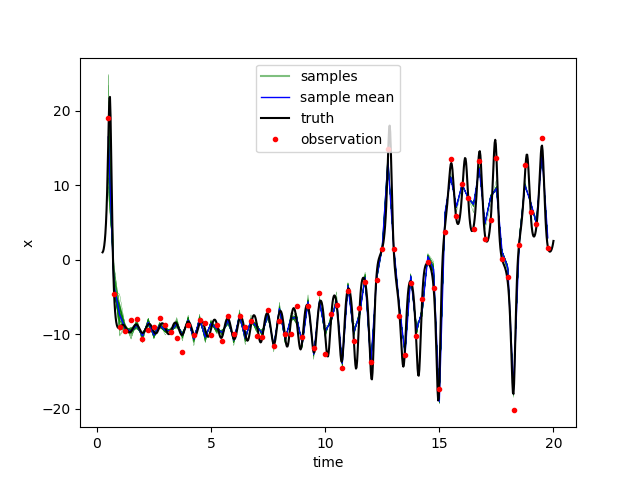

Tutorial: Diffusion
===================
This tutorial provides the instructions to run the code for one dimension diffusion equation using the provided Tutorials (located in the ''$tutorials/diffusion'').

Problem Description
-------------------
The heat diffusion equation for a rod can be expressed as following:

.. math::

   \frac{d}{dx}(\mu \frac{du}{dx}) = f(x) \qquad x \in [0, 5]

where :math:`\mu` are unknown thermal diffusivity to be infered varying with the location in the rod, :math:`u` is the temperature and :math:`f(x)` is external heat source term which in this case is simplfied as :math:`f(x) = sin( 0.4 \pi x)`.

Field Representation
--------------------

For field inverse problem, the high dimensionality will lead to the solution diversity. Thus it is necessary to reduce the dimensionality. To represent the field, the common method is proper orthogonal decomposition (POD). By first we need to represent the field with Karhunen-Loeve expansion which is commonly used to represent the stochatic process through a combination of a set of orthogonal functions. In this case, the method is leveraged to reduce the dimension of state varibles.

The field of viscosity is reconstructed by a set of deterministic functions with corresponding random variables:

.. math::

   \mu(x) = \sum_{i=1}^m \omega_i \phi_i(x)
   :label: kl

where the coefficient is the :math:`i`th mode :math:`\omega_i`, is a random variable and :math:`\phi_i(x)` is the deterministic basis set.

The prior of :math:`\mu(x)` is regarded as zero-mean Gaussian random fields, where the covariance of two different location (kernel function) is described as:

.. math::

   K(x,x')=\sigma(x)\sigma(x')exp(-\frac{|x-x'|^2}{l^2})
   :label: kernel

The prior variance :math:`\sigma(x)` is a constant or a spatially varying field, defined as:

.. math::
   
   \sigma =
   \begin{cases}
   & \frac{8}{5}x + 1 \qquad  &x \in [0, 2.5] \\ 
   & -\frac{8}{5}x + 9 \qquad &x \in (2.5, 5] 
   \end{cases}

The correction length scale :math:`l` is simplified as constant 5 in this tutorial.

The orthogonal basis function :math:`\phi_i(x)` in :eq:`kl` take the form :math:`\phi_i(x)=\sqrt{\hat{\lambda_i}}\hat{\phi_i}(x)`, where :math:`\hat{lambda_i}` and :math:`\hat{\phi_i}(x)` are the eigenvalues and eigenvectors, respectively, of the kernel :math: `K` in :eq:`kernel` computed from the Fredholm integral equation:

.. math::

   \int K(x,x')\hat{\phi(x')dx' = \hat{\lambda}\hat{\phi}(x)

Thus the randomized value :math:\omega_i can be inferred through data assimilation method

Data Assimilation Method
------------------------

To infer the unknown viscosity field for the diffusion model based on the synthetic observation is the inverse problem in this tutorial.

Data assimilation method is to solve the inverse problem.

Different data assimilation methods are embeded in the code (located in the "$source/da_inv/da_filtering.py"). The list of usable data assimilation methods is shown below:

#. Ensemble Kalman Filtering :cite:`iglesias2013ensemble`
#. Ensemble Randomized Maximal Likelihood :cite:`gu2007iterative`
#. Ensemble Kalman Filtering-Multi Data Assimilation :cite:`evensen2018analysis`

Building the Dynamic Model
--------------------------
This is a stationary system, so only forward model is concerned. The forward model in this tutorial is one dimension diffusion equation. The central difference scheme is used to solve the diffusion equation. The finite difference method is applied to replace the partial derivation of viscosity in equation. The python script for diffusion model is created in the "source/dyn_models/diffusion.py"

.. literalinclude:: ../../source/dyn_models/diffusion.py

Diffusion Model Files
---------------------

Below is an overview of the files required to run the data assimilation for forward model in DA-Inv. The required files are listed below.

==================   =============================  =============================
**File Type**        **File Name**                  **Directory**
Input File           ``dainv.in``                   ``/tutorials/diffusion``
Input File           ``diffusion.in``               ``/tutorials/diffusion``
Forward Model        ``diffusion.py``   		       ``/source/dyn_models/``
==================   =============================  =============================

Run Tutorial
------------

Step 1 : Write main input file
~~~~~~~~~~~~~~~~~~~~~~~~~~~~~~

Specify self-defined parameters in the 'dainv.in' file. The 'dainv.in' file is provided in the diffusion tutorial directory and shown below.

.. literalinclude::../../../tutorials/diffusion/dainv.in
   :language: python

.. Note::

		Mainly need to specify the ensemble samples (nsamples) and the forward steps (max_pseudo_time)

Step 2 : Write forward model input file
~~~~~~~~~~~~~~~~~~~~~~~~~~~~~~~~~~~~~~~

Specify self-defined parameters in the 'diffusion.in' file. The 'diffusion.in' file is provided in the diffusion tutorial directory and shown below.

.. literalinclude::../../../tutorials/diffusion/diffusion.in
   :language: python

.. Note::

		Mainly need to specify the number of modes (nmodes), the synthetic true value for each mode coefficent (true_omega) and the relative standard deviation for observation (obs_rel_std)

Step 3 : Execute
~~~~~~~~~~~~~~~~

To execute the data assimilation for lorenz system, move to the directory of '$source' and type '. init_da.sh' to export the PATH. Then move to the lorenz directory($tutorials/lorenz), type './run.sh' to start the data assimilation process. The process information will be saved in 'log.enkf' file at lorenz tutorial directory.

Step 4 : Postprocessing
~~~~~~~~~~~~~~~~~~~~~~~

'Lorenz_plot.py' (located in '$tutorials/lorenz') is the postprocessing file to plot the trajectory of state varible 'x' 'y' and 'z'.

To execute the postprocessing, type './plot.sh' to plot figures as shown below. Users can modify the 'lorenz_plot.py' for their own post-processing

.. figure:: _static/timeSeries_DA_y.png
   :width: 400pt

.. figure:: _static/timeSeries_DA_z.png
   :width: 400pt

References
------------------------
.. bibliography:: tutorial.bib
   :style: unsrt
   :labelprefix: B
